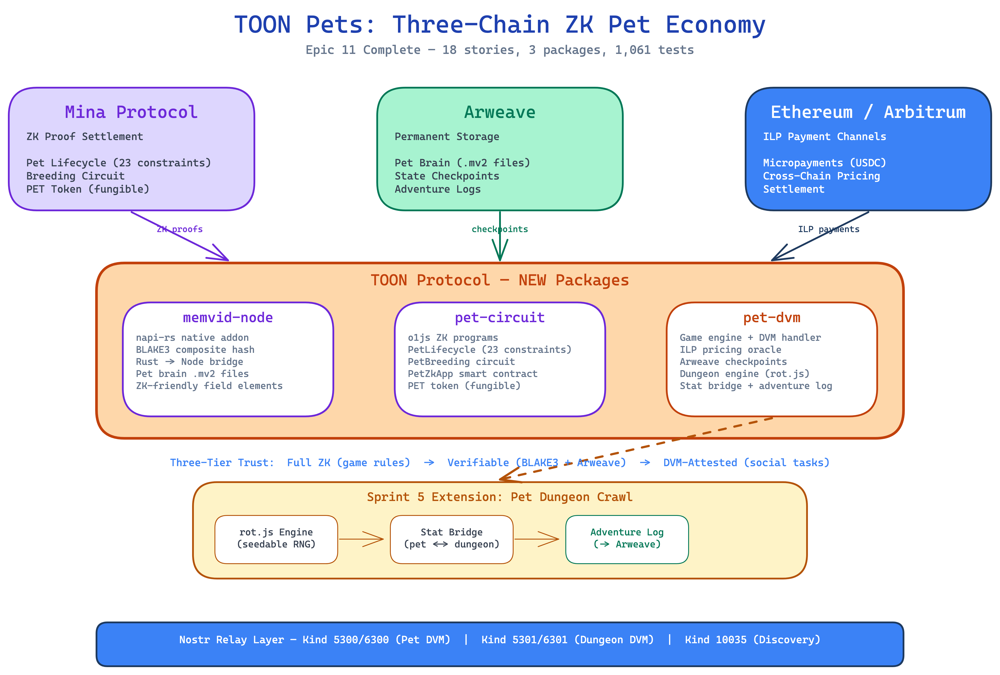

# Dev Signal: TOON Pets Complete — ZK-Proven Pet Economy Ships with Dungeon Crawl

**Date:** 2026-04-09
**Type:** epic-close
**Epic:** Epic 11 — TOON Pets: ZK-Proven Virtual Pet Economy (18/18 stories)
**Priority:** RED

## Headline

TOON ships the first ZK-proven virtual pet economy on Interledger — 18 stories, 3 new packages, procedural dungeon crawl, and a breeding circuit. Every pet interaction is provable on Mina, paid via ILP micropayments, and permanently stored on Arweave.

## Technical Summary

Epic 11 delivered the complete TOON Pets stack across 5 sprints. Three new packages: `@toon-protocol/memvid-node` (napi-rs BLAKE3 native addon for pet brain hashing), `@toon-protocol/pet-circuit` (o1js ZK proofs for pet lifecycle, breeding, and PET token), and `@toon-protocol/pet-dvm` (game engine, DVM handler, cross-chain pricing, Arweave checkpoints, dungeon crawl engine, and adventure logging). The architecture uses a three-tier trust model: full ZK proofs for game rules (23 constraints per interaction), verifiable BLAKE3+Arweave for memory state, and DVM-attested receipts for social tasks. A mid-epic extension added a procedural dungeon crawl system using rot.js with seedable RNG, stat bridging, and permanent adventure logs on Arweave.

## Narrative Hooks (for Drew)

- **External (crypto/DeFi):** TOON Pets is the anti-lootbox. Every stat change, every evolution, every breeding outcome is enforced by a ZK circuit on Mina — not a server-side RNG. Players own cryptographic proof that the game is fair. The PET token economy runs on cross-chain ILP micropayments with bigint-precision pricing. This is what "provably fair gaming" actually looks like when you remove the trust assumptions.

- **Industry (Arweave/AO):** Three-chain convergence in a single product: Mina for ZK proof settlement, Arweave for permanent pet state and adventure logs, Ethereum/Arbitrum for ILP payment channels. The checkpoint automation means pet brain state is durably stored on Arweave with mandatory tags — a real-world permanent storage use case, not just data archival. Drew can position this as the first application that makes Arweave's permanence *functional*, not just aspirational.

- **Nostr ecosystem:** Pets live on Nostr. Kind 5300/6300 for pet interactions, Kind 5301/6301 for dungeon runs, Kind 10035 for DVM service discovery. The marketplace uses NIP-15 patterns. This is the first Nostr application where the relay enforces game rules via ZK proofs — a new category of "verifiable social computing" on the protocol.

- **Developer audience:** Three clean packages with 755 tests. The pet-dvm package alone has 299 tests covering a game engine, DVM handler, pricing oracle, checkpoint manager, dungeon engine, stat bridge, and adventure logger. Every function follows the factory pattern, every error has typed codes, every adapter is injectable. The rot.js dungeon engine uses seedable RNG — same seed, same dungeon, every time. Deterministic procedural generation that's testable without flakiness.

- **Mainstream tech press:** "Virtual pets with math proofs" — TOON built Tamagotchi where you can prove every feeding, every evolution, every dungeon battle actually happened as reported. The breeding circuit means two parents produce offspring with deterministic, verifiable genetics. No one can cheat the system, not even the server operators.

## Key Stats

- Stories delivered: 18/18 (100% — 14 original + 4 dungeon extension)
- Tests: 1,061 passing across 3 packages (+755 new)
- Code review issues: 114 found, 106 fixed, 8 accepted (0 critical remaining)
- Security findings: 0 (semgrep, 210+ rules per scan)
- Traceability: 96% overall (P0: 100%, P1: 98%)
- New packages: 3 (@toon-protocol/memvid-node, pet-circuit, pet-dvm)
- ZK constraints: 23 per pet interaction (~3,500 rows)
- Dungeon features: procedural generation, combat, loot, stat bridging, adventure logs
- Duration: 5 sprints across 3 days

## Assets

- [x] Architecture diagram: 
- [ ] Screenshot: (no UI running — suggest screenshot of proof status badge component or dungeon engine test output)
- [ ] Demo-able flow: `pnpm --filter @toon-protocol/pet-dvm test` shows the full dungeon crawl + stat bridge + adventure log pipeline
- [x] Metrics: 18/18 stories, 1,061 tests, 96% traceability, 0 security findings
- [ ] Before/after: Epic 10 had 0 pet packages → Epic 11 delivered 3 with full ZK stack

## Discord Drop

```
RED | Epic 11: TOON Pets — ZK-Proven Virtual Pet Economy
--------------------------------------
Headline: First ZK-proven virtual pet economy ships — 18 stories, 3 packages, dungeon crawl included.

Every pet interaction runs through a 23-constraint ZK circuit on Mina. Pets eat, play, evolve, breed, and crawl procedural dungeons — all provably fair, paid via ILP micropayments, stored permanently on Arweave.

Hooks for Drew:
-> "The anti-lootbox" — provably fair pet gaming with ZK math, not server trust
-> Three-chain convergence: Mina (proofs) + Arweave (permanence) + ETH (payments) in one product
-> First Nostr app where the relay enforces game rules via ZK proofs — new category
-> Procedural dungeon crawl with deterministic RNG — same seed, same dungeon, every time

Stats: 18/18 stories | 1,061 tests | 755 new | 0 security findings | 96% traceability
New packages: memvid-node (Rust/napi-rs), pet-circuit (o1js/ZK), pet-dvm (game engine + DVM)

Assets: architecture diagram pending, test suite demo-able
```
